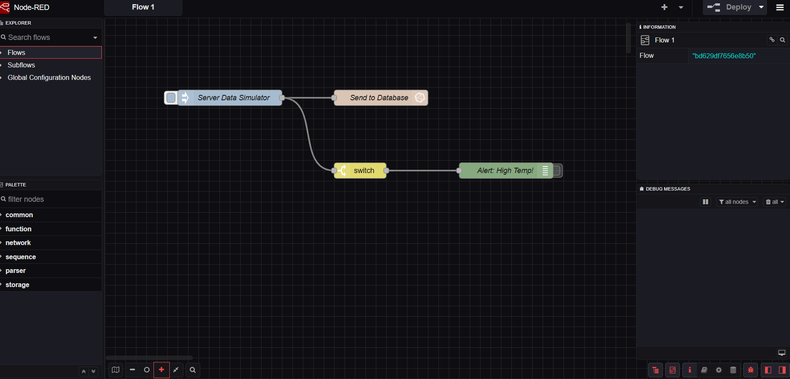
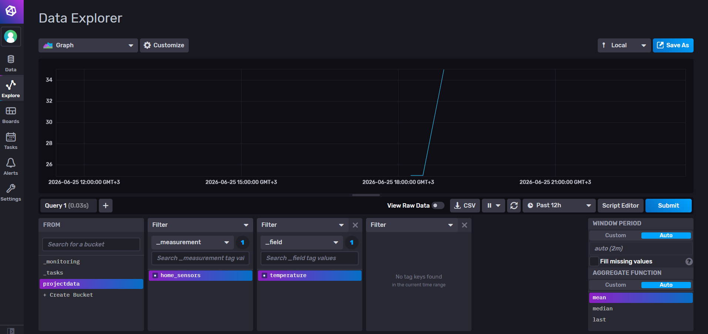
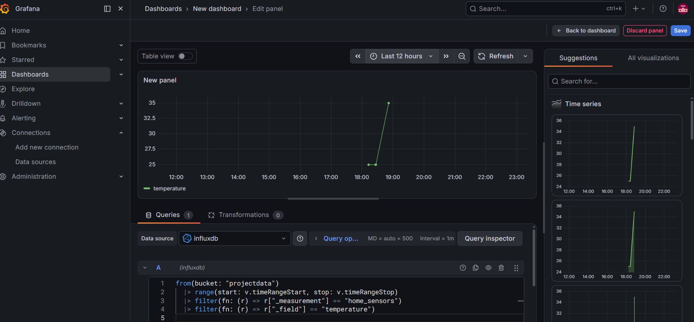

# IoT Monitoring System (Node-RED + InfluxDB + Grafana)

An end-to-end IoT monitoring system using Node-RED, InfluxDB, and Grafana, deployed with Docker.

## Features
- **Data Collection:** Using Node-RED to capture and process sensor data.
- **Data Storage:** Persisting data in InfluxDB (Time Series Database).
- **Visualization:** Real-time dashboards created with Grafana.
- **Containerization:** Managed using individual Docker containers.

## How to Get Started
1. Ensure you have Docker installed on your machine.
2. Run the following commands in your terminal to start the services:

   ```bash
   # Start Node-RED
   sudo docker run -d -p 1880:1880 --name my-nodered nodered/node-red:latest

   # Start InfluxDB
   sudo docker run -d -p 8086:8086 --name my-influxdb influxdb:2.0

   # Start Grafana
   sudo docker run -d -p 3000:3000 --name my-grafana grafana/grafana:latest

### Project Overview
This IoT Monitoring System was developed to demonstrate real-time data acquisition and visualization capabilities. Designed for smart agricultural applications, the system monitors environmental parameters (such as temperature) to optimize automated processes, ensuring efficient resource management and system reliability

## System Visuals

### Node-RED Flow


### InfluxDB Data


### Grafana Dashboard



